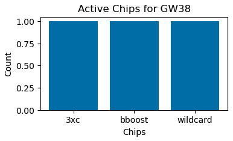
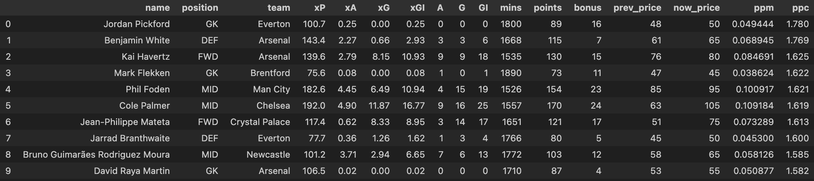
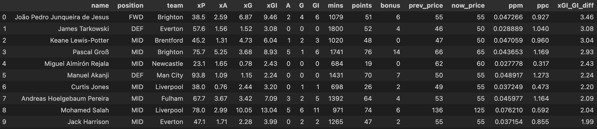
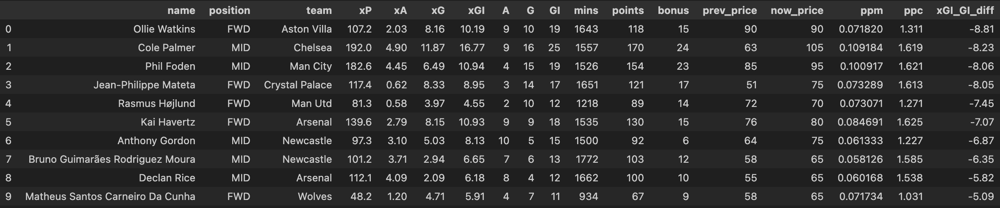

# FPL-viz

Some neat tools for the official Fantasy Premier League (FPL) game. 

As the Commisioner of an FPL league, I created a few informative tools to make the season more fun! 

Lots of thanks to Jack Somervell and his article [A Complete Guide to the Fantasy Premier League (FPL) API](https://www.game-change.co.uk/2023/02/10/a-complete-guide-to-the-fantasy-premier-league-fpl-api/)!

## League user visualizations
To get started, we need your league's ID, which can be found like so:

**To get league ID**: Fantasy &rarr; Leagues and Cups &rarr; select your league

league_id = **numbers before "/standings/"** in the URL

ie: for my league, the URL is https://fantasy.premierleague.com/leagues/736795/standings/c, so my league ID would be "736795".

### Get league data

Once we have the league ID, we can use the ```save_league_data``` function to fetch our league's data. 

### Get user data

From our saved league data, we can get individual manager/user data using the ```get_users``` function

This function also saves the manager name and ID of the user data as a pickle dictionary (**entry_to_player_dict.pickle**). 

### Get user data across time

Using the ```league_{league_id}_entry_to_player_dict.pickle``` dictionary, we can get the user data across the course of the league. In other words, we can get the number of points for each gameweek. 

Fetch the history data by using the ```fetch_and_save_history``` function. Make a df of this data using the ```get_gw_history_df``` function. 

## Plotting Standings

### Plot current standings

Use the ```plot_current_standings``` function!


### Lineplot of standings across the season

Use the ```lineplot_gw_history``` function


### Bar chart race of standings across the season

Use the ```bar_chart_race_gw_history``` function! 


## Gameweek specific visualizations

Note: these scripts can only run for a GW after teams are locked in (1.5 hours before the first game)!

- chip usage
- captaincy
- most owned players

### Current GW chip data

Use the ```plot_active_chips``` function!



### Captaincy for current GW

Use the ```plot_captaincy``` function!


### Most owned players

Use the ```plot_most_owned``` function!


## Fixture Difficulty Rating (FDR) Representational Similarity Matrices (RSM)

Players with easier fixtures tend to get more points. The ```GW_FDR_RSM.ipynb``` notebook has some functions to find out which teams have the easiest fixtures and which teams complement each other best, for a given set of GWs. 

## Plot FDR Sum

Use the ```plot_fdr_df``` function!


## Plot FDR RSM

Use the ```get_and_plot_fdr_rdm``` function!

This plot allows us to see which teams have dissimilar GW difficulty scores

It is helpful for substitutions and backups - when one player has a bad fixture in a given GW, we can try to get a different player with a good fixture on that GW. 

The higher the value in the RDM, the more different the FDR for the select gameweeks. 0 values mean they have the same FDRs - ie: the diagonal compares each team to itself, so the value of the diagonal = 0. 

--- 

In FPL, a known strategy is to purchase two low cost (<4.5) keepers and rotate them out. How do we select these two keepers? 

This season (2023-24), there were a few promising keepers who cost $4.5 or less:
- Bernd Leno (FUL)
- Jordan Pickford (EVE)
- Matt Turner (NFO)
- Lukasz Fabianski (WHU)

Let's see how we can find the best rotation of keepers based on maximally disimilar FDRs (for the first 10 GWs)!


Based on the plot, we can see that Everton and Nottingham Forrest have the pairwise maximally distinct FDRs! When Pickford has a hard fixture (GW5 & GW9; FDR=4),  Turner has easier fixtures (FDR=2). 

## Preaseason Player Scouting

Some helpful data on players for the upcoming season. 

### Points Per Cost

Last seasons points based on this year's price. Only for games in the last half of the season (GWs 19-38). 



### Undeperforming players

Expected goal involvements vs. goal involvements. 



### Overperforming players

Expected goal involvements vs. goal involvements. Ollie Watkins assisted a lot more than he was expected to - his value might be misleading. However, Douglas Luis was transferred out, so Watkins may now be on penalties. 


